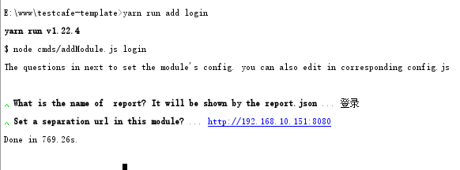
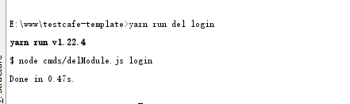

# generator-testcafe-template [![NPM version][npm-image]][npm-url] [![Build Status][travis-image]][travis-url] [![Dependency Status][daviddm-image]][daviddm-url] [![Coverage percentage][coveralls-image]][coveralls-url]
> to build a ui-test project by using testcafe

## 一、全局安装基本工具

```
>npm install -g yo
>npm install -g generator-testcafe-template
```

## 二、构建项目

```
>mkdir your-project-name
>cd your-project-name
>yo testcafe-template
```

## 三、目录结构

```
├─app.js    					#启动测试的js脚本
├─globalConfig.js				#全局配置项
├─package-lock.json
├─package.json
├─report.json					#测试报告产生的json文件
├─reporter.js					#配置报告格式的js模块
├─shared-module.js
├─yarn.lock
├─test_modules
|      ├─default				#单个测试模块
|      |    ├─cases.js  		#编写测试案例的js
|      |    ├─config.js			#单个模块的配置项
|      |    └index.js			#单个模块的导出js
├─testResult
|     └reporter-testResult.html #项目中最后输出的html版测试报告
├─js
| ├─createHtml.js				#创建html版本测试报告的js模块
| └template.html				#html测试模板文件
├─cmds
|  ├─addModule.js
|  └delModule.js
```

## 四、开始使用

### (1) 新增一个测试模块

#### 1.操作流程

```
项目目录下cmd键入：
>yarn run add 模块名称
```

```
#以新增 login 模块为例：

>yarn run add login

#输入显示于模板文件中的模块名称，不输入时会使用初始值login
? What is the name of  report? It will be shown by the report.json »...登录

#输入自定义的测试页面路径,默认全局路径配置为http://127.0.0.1:8080(可修改)
?Set a separation url in this module?...http://192.168.10.151:8080
```




#### 2.模块内容

##### I.cases.js

```javascript
const fromData = {
   //you could write down the form data here
}

//the 'case' in 'desc' are the  cases' names will be write down to report.json
const listAction = [
    {
        desc: 'case1',
        action: async page => {
           //todo
        }
    },

    {
        desc: 'case2',
        action: async page => {
            //todo
        }
    },
    {
        desc: 'case3',
        action: async page => {
            //todo
        }
    },

]
export default listAction
```

你可以在上面的action方法里使用testcafe的API书写需要进行测试的每个步骤的代码。

你可以在上面的desc属性中修改每个步骤的自定义名称，它将会显示在报告里面。


##### II. config.js

```javascript
export default {
    url:"http://192.168.10.151:8080",
    unitName:"登录",
}
```

上面的url和unitName属性是你在创建过程中的键入内容，你也可以在这个文件中自行修改配置项。

##### III. index.js

```javascript
import {sharedInfo} from '../../shared-module'
import config from './config'
import listAction from './cases'
fixture`${config.unitName}`.page`${config.url}`;

test(config.unitName, async I => {
    sharedInfo[config.unitName] = listAction
    for (let i = 0;i< listAction.length;i++){
        sharedInfo[config.unitName][i]["isPass"] = false
        await listAction[i].action(I)
        sharedInfo[config.unitName][i]["isPass"] = true
    }
})
```

模块的导出js，你可以在此修改一些关于报告内容或者其他测试动作的操作。详情请询问作者或者查看testcafe的文档。


### (2) 删除一个测试模块

#### 操作流程

```
项目目录下cmd键入：
>yarn run del 模块名称
```

```
#以新增 login 模块为例：

>yarn run del login
```




效果如上图，指定的模块将会被删除。


## 五、全局配置内容

```javascript
/*项目根目录下的 globalConfig.js */
module.exports = {
  "reportUrl": "report.json",
  // 设置需要执行的浏览器
  "browsers": ["chrome"],
  // 需要运行的test_modules
  "test_modules": [
    "./test_modules/default/index.js",
    "./test_modules/login/index.js",
  ],
  // 错误自动截图
  "screenshots": {
    // 保存路径
    "path": "./error/",
    "takeOnFails": true,
    // 保存路劲格式
    "pathPattern": "${DATE}_${TIME}/test-${TEST_INDEX}/${USERAGENT}/${FILE_INDEX}.png"
  },
  // 并发量
  "concurrency": 2,
  "runner": {
    "skipJsErrors": true,
    "quarantineMode": false, // 隔离模式，可以理解为失败重跑
    "selectorTimeout": 5000,// 设置页面元素查找超时时间,智能等待
    "assertionTimeout": 7000,// 设置断言超时时间
    "pageLoadTimeout": 30000,// 设置页面加载超时时间
    "debugOnFail": false,    // 失败开启调试模式 脚本编写建议开启
    "speed": 1               // 执行速度0.01 - 1
  },
  "defaultTestUrl":"http://127.0.0.1:8080" //默认测试页面路径
}
```

## 六、testcafe的常用API以及使用

### t.click(点击)

点击页面上的一个元素.

```text
t.click( selector [, options] )
```

| 参数                 | 类型                                                  | 说明                                                         |
| :------------------- | :---------------------------------------------------- | :----------------------------------------------------------- |
| `selector`           | Function \| String \| Selector \| Snapshot \| Promise | 定义需要点击的元素. 详情点击 [Select Target Elements](https://devexpress.github.io/testcafe/documentation/reference/test-api/testcontroller/click.html#select-target-elements)查看 |
| `options` *(可选项)* | Object                                                | 提供此次测试操作的额外配置项. 详情点击 [Options](https://devexpress.github.io/testcafe/documentation/reference/test-api/testcontroller/click.html#options)查看 |

如何在本框架中使用`t.click` :

```js

import { Selector } from 'testcafe';

const checkbox = Selector('#testing-on-remote-devices');

//the 'case' in 'desc' are the  cases' names will be write down to report.json
const listAction = [
    {
        desc: 'Click a check box and check its state',
        action: async page => {
           //todo
            page.click(checkbox).expect(checkbox.checked).ok();
        }
    },
       {
        desc: 'Click a check box and check its state',
        action: async page => {
           //todo
            page.click(checkbox).expect(checkbox.checked).ok();
        }
    },
       {
        desc: 'Click a check box and check its state',
        action: async page => {
           //todo
            page.click(checkbox).expect(checkbox.checked).ok();
        }
    },
    ]
```

###  t.pressKey(键盘操作)

- [pressKey](https://devexpress.github.io/testcafe/documentation/reference/test-api/testcontroller/presskey.html)

###  t.expect (监听元素或事件值的变动)

- [expect](https://devexpress.github.io/testcafe/documentation/reference/test-api/testcontroller/expect/)
- [expect.contains](https://devexpress.github.io/testcafe/documentation/reference/test-api/testcontroller/expect/contains.html)
- [expect.eql](https://devexpress.github.io/testcafe/documentation/reference/test-api/testcontroller/expect/eql.html)
- [expect.gt](https://devexpress.github.io/testcafe/documentation/reference/test-api/testcontroller/expect/gt.html)
- [expect.gte](https://devexpress.github.io/testcafe/documentation/reference/test-api/testcontroller/expect/gte.html)
- [expect.lt](https://devexpress.github.io/testcafe/documentation/reference/test-api/testcontroller/expect/lt.html)
- [expect.lte](https://devexpress.github.io/testcafe/documentation/reference/test-api/testcontroller/expect/lte.html)
- [expect.match](https://devexpress.github.io/testcafe/documentation/reference/test-api/testcontroller/expect/match.html)
- [expect.notContains](https://devexpress.github.io/testcafe/documentation/reference/test-api/testcontroller/expect/notcontains.html)
- [expect.notEql](https://devexpress.github.io/testcafe/documentation/reference/test-api/testcontroller/expect/noteql.html)
- [expect.notMatch](https://devexpress.github.io/testcafe/documentation/reference/test-api/testcontroller/expect/notmatch.html)
- [expect.notOk](https://devexpress.github.io/testcafe/documentation/reference/test-api/testcontroller/expect/notok.html)
- [expect.notTypeOf](https://devexpress.github.io/testcafe/documentation/reference/test-api/testcontroller/expect/nottypeof.html)
- [expect.notWithin](https://devexpress.github.io/testcafe/documentation/reference/test-api/testcontroller/expect/notwithin.html)
- [expect.ok](https://devexpress.github.io/testcafe/documentation/reference/test-api/testcontroller/expect/ok.html)
- [expect.typeOf](https://devexpress.github.io/testcafe/documentation/reference/test-api/testcontroller/expect/typeof.html)
- [expect.within](https://devexpress.github.io/testcafe/documentation/reference/test-api/testcontroller/expect/within.html)

### t.typeText(在表单元素中输入文本)

- [typeText](https://devexpress.github.io/testcafe/documentation/reference/test-api/testcontroller/typetext.html)

### t.navigateTo(页面重定向)

- [navigateTo](https://devexpress.github.io/testcafe/documentation/reference/test-api/testcontroller/navigateto.html)

## 七、实现效果

测试项目根目录下键入>yarn start

等待程序运行完毕 程序运行产生报告效果如下：


## Getting To Know Yeoman

 * Yeoman has a heart of gold.
 * Yeoman is a person with feelings and opinions, but is very easy to work with.
 * Yeoman can be too opinionated at times but is easily convinced not to be.
 * Feel free to [learn more about Yeoman](http://yeoman.io/).

## License

MIT © [RJKKK]()


[npm-image]: https://badge.fury.io/js/generator-testcafe-template.svg
[npm-url]: https://npmjs.org/package/generator-testcafe-template
[travis-image]: https://travis-ci.com/RJKKK/generator-testcafe-template.svg?branch=master
[travis-url]: https://travis-ci.com/RJKKK/generator-testcafe-template
[daviddm-image]: https://david-dm.org/RJKKK/generator-testcafe-template.svg?theme=shields.io
[daviddm-url]: https://david-dm.org/RJKKK/generator-testcafe-template
[coveralls-image]: https://coveralls.io/repos/RJKKK/generator-testcafe-template/badge.svg
[coveralls-url]: https://coveralls.io/r/RJKKK/generator-testcafe-template
